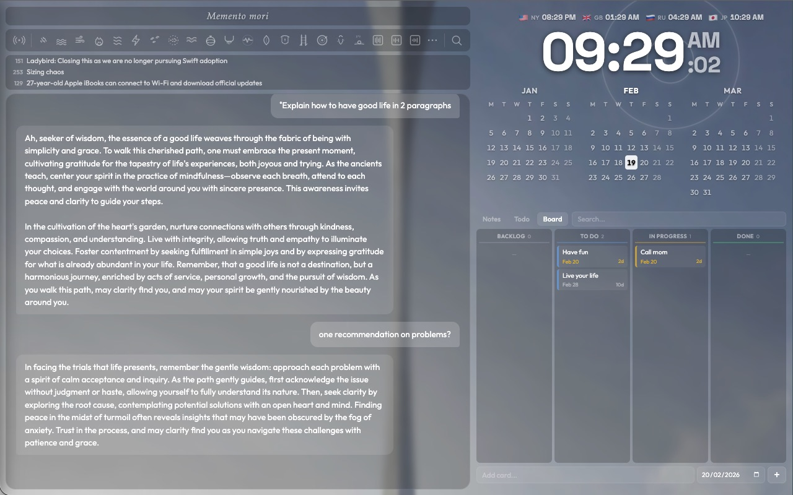
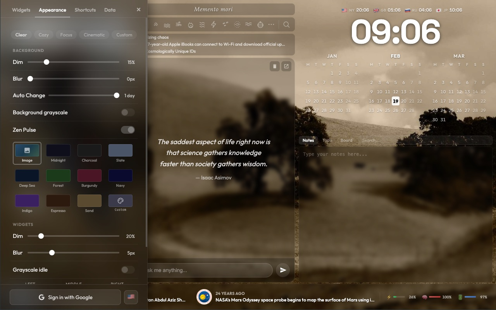
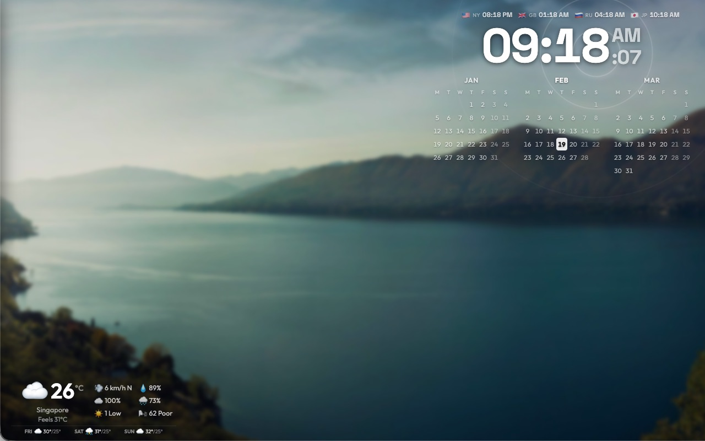
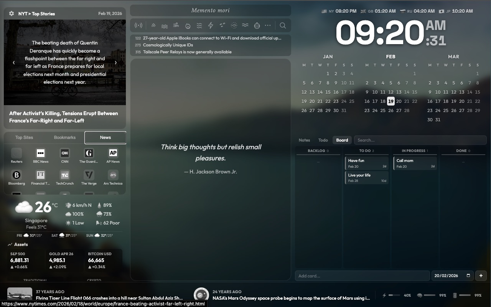

# Zen Launcher

*A new tab extension that watches time pass.*

## Overview

Every moment dissolves into the next. Every refresh brings a new background, a new quote, a new pulse at the hour's edge.

Information flows. Markets fluctuate. The world outside presses against the glass. Everything you might need to know, arranged in the shadows of passing time.

The clock ticks. The news scrolls. The ambient sounds hum beneath it all.

What you do with this awareness is yours alone.

## Configuration

Settings hide in the corners. Gear icons scattered across panels. Click them if you seek control.

Some features require keys. Some require permissions. The extension will ask when the time comes.

## Development Installation

1. Open `chrome://extensions/`
2. Enable **Developer mode**
3. Click **Load unpacked**
4. Select this folder

